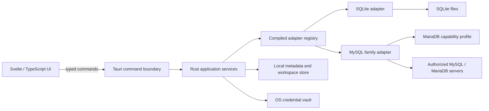

# QueryNot Product Requirements Document

Date: 2026-08-23
Status: Approved for implementation — revision 3
Product: QueryNot  
Initial release: Everyday developer workflow  
Decision owner: QueryNot product owner

> Query your data, not your patience.

## 1. Document purpose

This document defines the planned product, architecture boundaries, initial-release requirements, acceptance criteria, and roadmap for QueryNot. It is a product specification, not a statement of implemented behavior. Revision 2 preserved the complete everyday database workflow while changing the first public release envelope and evidence boundary by product-owner decision. Revision 3 retains that historical initial-release record and approves the post-`0.1.4` Windows, Linux, and macOS distribution expansion in ADR 0016.

The words **must**, **should**, and **may** indicate required, preferred, and optional behavior. All numbered requirements are release-blocking unless they explicitly say otherwise. A capability is not considered shipped until it exists in the repository and passes the release gates in this document.

This baseline is ready to decompose into architecture decisions, issues, and vertical implementation slices. Product approval changes the status to **Approved for implementation**; it does not change the scope. Any implementation discovery that would alter a numbered requirement, a fixed decision, a security boundary, or a release gate must update this document or create a linked decision record before the affected work is merged.

### 1.1 Requirement and evidence convention

- Requirement identifiers are stable. Deleted requirements are retired rather than renumbered.
- **Must** requirements block the initial release. **Should** requirements block release unless the product owner records a time-bounded exception. **May** requirements are non-blocking and must not be implied in the interface when absent.
- Every implementation issue must cite the requirement identifiers it satisfies. Every requirement must map to automated or manual acceptance evidence in the release traceability matrix.
- Acceptance evidence includes the commit, tested platform and database versions, fixture, command or procedure, result, and retained artifact such as a report, screenshot, recording, or benchmark output.
- “Initial release” means the first publicly distributed pre-1.0 build declared usable for the everyday workflow in this document. Internal foundation builds are not the initial release.
- For revision 2, the claimed and distributed platform is Windows 11 x86-64. WSL2 is an approved development and automated-validation environment, not a supported application platform. Windows 10, macOS, and native Linux distribution are deferred until a later approved support-matrix expansion.
- The product owner is the sole initial participant. Native human checks, the five-day dogfood checklist, and external beta are retained as post-release validation work and do not block `0.1.0`. Their absence must be labelled as deferred; no unperformed result may be recorded as a pass.
- Release-blocking evidence for `0.1.0` consists of reproducible WSL2 automation, disposable database conformance, automated browser layout/accessibility checks, dependency/security policy gates, and real Windows package construction, inspection, and checksums. The approved scope record must identify every nonblocking post-release check.
- For `0.1.5` and later releases governed by ADR 0016 and ADR 0017, the prepared distribution matrix is Windows 11 x86-64, Linux x86-64, macOS Intel, and macOS Apple silicon. Every published platform payload must come from the same reviewed candidate commit and pass the combined package, checksum, updater-signature, manifest, draft asset-digest, and exact-inventory gates. The original `0.1.0` evidence boundary remains historical and must not be rewritten as cross-platform evidence.

### 1.2 Product assumptions

- Users have authorization and network or filesystem access to every database they configure.
- QueryNot does not provision databases, change server permissions, repair corrupt database files, or guarantee server-side query performance.
- Database servers, database metadata, cell values, SQL files, and error text are untrusted input and may be malformed, unexpectedly large, or intentionally hostile.
- An operating-system credential vault may be locked or unavailable. QueryNot must remain usable with session-only credentials and must never fall back to plaintext secret persistence.
- Release support is limited to the exact operating-system, architecture, database, authentication, and TLS combinations published in the release compatibility matrix.

### 1.3 Glossary

| Term                   | Meaning                                                                                                                                                                   |
| ---------------------- | ------------------------------------------------------------------------------------------------------------------------------------------------------------------------- |
| Profile                | Non-secret saved connection configuration plus an opaque reference to an optional saved credential.                                                                       |
| Connection             | A live logical association between a profile and its native database resources.                                                                                           |
| Native session         | One adapter-owned database session with isolated session variables, current database/schema, transaction state, and active job.                                           |
| Query tab              | An editor document bound to one profile and, while connected, one dedicated native session.                                                                               |
| Table-data tab         | A single-table browse/edit surface with its own native session and staged changes.                                                                                        |
| Execution              | One user-authorized run attempt with a stable execution ID and one or more ordered statement outcomes.                                                                    |
| Received rows          | Rows already transferred from the driver into QueryNot; this excludes rows that still exist only on the server or native cursor.                                          |
| Result tranche         | The additional row budget authorized by the initial run or one explicit **Load more** action.                                                                             |
| Usable row identity    | A primary key or adapter-approved unique, non-null key that identifies exactly one base-table row.                                                                        |
| Effective predicate    | A top-level target-row predicate the dialect parser can classify as restrictive; missing, constant-true, malformed, or uncertain predicates are not considered effective. |
| Sensitive product data | Credentials, connection endpoints, SQL text, database metadata, result values, file paths, certificates, and diagnostic context that may identify a user or system.       |

## 2. Product summary

QueryNot is a local-first desktop SQL client for software developers. It launched on Windows 11 and distributes on Windows, Linux, and macOS beginning with `0.1.5`. It is intended to replace MySQL Workbench and DBeaver for routine development work with a faster, calmer, and more dependable experience.

The initial release focuses on the complete everyday loop:

1. Save or open a database connection.
2. Navigate its schema.
3. Write, format, and execute SQL.
4. Cancel work that is taking too long.
5. Inspect, copy, filter, and export results.
6. Browse and safely edit table rows.
7. Return later to restored tabs, drafts, and local history.

QueryNot will launch with SQLite, MySQL, and MariaDB support. PostgreSQL is the first engine planned after the initial release. Database engines are implemented as compiled-in adapters behind a capability-based contract so another engine can be added without redesigning the application or exposing adapter mechanics to users.

## 3. Problem statement

Developers frequently use broad database tools whose everyday workflow is burdened by slow startup, dense chrome, fragmented execution context, awkward tabs, weak result handling, and administration features that compete with common query work.

QueryNot addresses four connected problems:

- **Navigation friction:** connections and schema objects are harder to scan and reach than they should be.
- **Query friction:** the current connection, database, transaction state, selected statement, and execution action are not always obvious.
- **Result friction:** large results can make a client slow or unstable, while common copying, filtering, and exporting actions require too many steps.
- **Trust friction:** credentials, destructive SQL, cancellation, transactions, row edits, and local history are often handled opaquely.

The product should remove these sources of friction without becoming a server-administration suite in its first release.

## 4. Target audience and jobs

### 4.1 Primary user

A software developer who regularly connects to local, development, staging, or otherwise authorized SQLite, MySQL, or MariaDB databases to inspect schemas, write SQL, troubleshoot application behavior, and make deliberate data changes.

### 4.2 Secondary users

- Developers currently using DBeaver for mixed database work.
- Technical analysts whose workflow fits the supported query and export capabilities.
- Maintainers evaluating QueryNot before broader team adoption.

Database administrators are not a primary initial-release audience.

### 4.3 Core jobs to be done

- “Help me reach the correct database and query context quickly.”
- “Help me write correct dialect-aware SQL with less lookup and repetition.”
- “Let me run or stop exactly the work I intend.”
- “Let me understand and work with results without freezing the application.”
- “Let me make small table-data changes with a clear preview and rollback boundary.”
- “Restore my workspace without sending my work or credentials anywhere.”

## 5. Product principles

1. **Fast by default.** Frequent actions stay visible, responsive, and keyboard accessible.
2. **Calm, not sparse.** QueryNot is compact enough for technical work without surrounding every region with decorative chrome.
3. **Context creates confidence.** Connection, engine, database or schema, transaction state, active statement, execution status, and unsaved changes remain clear.
4. **Local-first.** Product data stays on the user's machine. Database traffic goes only to connections the user explicitly configures.
5. **Safe around data.** Secrets, TLS, destructive SQL, transactions, row edits, exports, history, and diagnostics have deliberate boundaries.
6. **Adapters express differences.** The product presents one coherent workflow while adapters expose engine capabilities and limitations honestly.
7. **Progressive depth.** Everyday query work is immediate; advanced and engine-specific behavior is available when relevant rather than permanently occupying the interface.
8. **Describe reality.** Unsupported capabilities are disabled or explained, never simulated or implied.

## 6. Goals and non-goals

### 6.1 Initial-release goals

- Replace MySQL Workbench and DBeaver for the project owner's routine development workflow.
- Support SQLite, MySQL 5.7+ with initial conformance coverage for 5.7.44, 8.0, and 8.4 LTS, and MariaDB 10.11 and 11.4 LTS through a common adapter architecture.
- Make MySQL-versus-MariaDB selection automatic after connection; users choose a single “MySQL / MariaDB” connection family.
- Deliver the complete core workflow through one portable architecture, with Windows 11 x86-64, Linux x86-64, macOS Intel, and macOS Apple-silicon packages governed by the release matrix.
- Provide a rich, dialect-aware SQL editor and an editor-first workspace.
- Safely stream and render large result sets with bounded memory use.
- Provide staged table-row insert, update, and delete operations with SQL preview and transactional rollback.
- Persist non-secret workspace data locally and credentials in the operating system credential vault.
- Align QueryNot's design language with PostNot while keeping the implementations independent until a separate shared-library project is approved.

### 6.2 Initial-release non-goals

- PostgreSQL or another database engine beyond SQLite, MySQL, and MariaDB.
- Installable or third-party adapter plugins.
- SSH tunnels, cloud-provider connection brokers, or bastion management.
- Server administration, service control, health dashboards, backup, restore, replication, users, roles, or permissions management.
- Visual schema design, ER diagram editing, schema diffing, or migration generation.
- A general-purpose database IDE with every engine-specific object editor.
- Multiple application windows, shared live sessions between tabs, or cross-tab transactions.
- Query parameters, template variables, stored credential macros, or automatic execution on file/session open.
- Raw socket, Unix-socket, Windows named-pipe, SSH, proxy, or cloud-provider connection transports; MySQL-family connections use direct TCP/TLS.
- Binary/LOB cell editing, arbitrary expression editors, or multi-table edit batches in the table-data grid.
- Importing connection profiles from MySQL Workbench, DBeaver, or other clients.
- Accounts, telemetry, hosted storage, cloud synchronization, or collaboration services.
- Code signing or notarization.
- Automatic application updates.
- Localization; the initial interface and documentation are English-only.
- A shared PostNot/QueryNot UI package. That extraction requires its own inventory, compatibility design, and migration plan.

## 7. Initial-release experience

### 7.1 Information architecture

QueryNot uses an editor-first workbench:

- A persistent left sidebar contains compact saved-connection rows, one compact Offline row, and the active connection's schema tree. Connections and Schema share a persisted pointer- and keyboard-resizable vertical split that defaults to 50% and is bounded to 20–80%; each region scrolls independently.
- The selected connection or Offline group owns one compact horizontal query/object tab strip above the main workspace.
- A compact context bar shows engine, connection, database or schema, and transaction state.
- The editor occupies the primary canvas.
- Results, messages, and related execution details appear directly below the editor in a resizable region.
- History opens as a secondary drawer or panel and does not displace the primary workflow by default.

At narrower desktop widths, the sidebar becomes an explicit overlay drawer. The connection/context trigger remains visible whenever the tree is hidden.

### 7.2 PostNot family alignment

QueryNot must feel like a sibling of PostNot, not an unrelated product or a literal copy. The initial visual system should carry forward these PostNot qualities:

- IBM Plex Sans for interface text and JetBrains Mono for SQL and technical values.
- Warm cream, deep teal/green, neutral, and burnt-orange relationships expressed through semantic tokens.
- Light, dark, and forest themes.
- A compact 4/8/12/16/20/24px spacing rhythm and 32–40px desktop controls.
- Restrained corners, flat workspace surfaces, dividers before cards, and shadows reserved for overlays.
- One dominant action per region, sentence-case labels, visible focus, and color-independent state.
- Dense trees and rows rather than card grids.

QueryNot must define and own its tokens and primitives locally during the initial release. It may adapt established PostNot concepts, but must not copy components blindly or create a premature cross-repository dependency. A later shared UI project should extract only primitives proven compatible in both products.

### 7.3 Core journey

The default journey is:

1. The user selects a saved connection or creates one manually.
2. QueryNot retrieves the secret from the OS credential vault and connects through Rust.
3. The sidebar loads schema metadata progressively and makes refresh state visible.
4. A new query tab inherits the selected connection and database/schema.
5. The editor provides syntax, formatting, completion, and diagnostics for the detected dialect.
6. Run executes selected SQL, otherwise the parsed statement at the cursor, otherwise the document's only non-empty statement; an ambiguous multi-statement document requires selection or explicit **Run all**.
7. Results stream into a virtualized grid while execution status, duration, and row count update.
8. The user may cancel, copy, filter loaded rows, load more, or export received rows.
9. Tabs, drafts, layout, and history restore locally on the next launch.

## 8. Functional requirements

### 8.1 Connection management

**CON-1 — Saved profiles.** Users must be able to create, edit, duplicate, test, connect, disconnect, rename, and delete connection profiles.

**CON-2 — SQLite.** The shared Create connection flow must offer a File target without asking the user to choose an adapter first. QueryNot probes only the explicitly selected local file through the native boundary, detects a supported SQLite database, returns an opaque file grant, and supports read-only or read-write profiles. It must not infer type from the extension, expose the full path to the WebView, or scan the filesystem for databases. Creating a new database file is deferred.

**CON-3 — MySQL / MariaDB.** A network profile must support host, port, optional default database, username, password, and TLS settings. The default port may be suggested but remains editable.

**CON-4 — TLS.** The MySQL-family connection flow must support unencrypted local/development connections with a clear warning, TLS using system trust, TLS with a custom CA, and client certificate authentication. A mode requiring verification must never silently downgrade. Certificate and key paths are treated as sensitive local-file metadata; private key contents must not be copied into ordinary app storage or logs.

**CON-5 — Credential storage.** Saving a password or reusable client-key passphrase is optional. Saved secrets must be stored through the operating system credential vault/keychain. Non-secret profile metadata is stored in QueryNot's local application data. The persisted profile contains an opaque secret reference, not the secret. Session-only secrets remain in native process memory only until disconnect or application exit.

**CON-6 — Transient secret handling.** A password entered in the UI may exist only in the active form long enough to submit it to the Rust boundary. It must not enter general frontend stores, session snapshots, history, logs, diagnostics, or crash output.

**CON-7 — Automatic engine selection.** The user selects “MySQL / MariaDB,” not an internal adapter. After connecting, QueryNot detects server identity and version, selects the compatible dialect/capability implementation, and shows the detected engine in connection context. Ambiguous or unsupported identities fail with a useful message rather than guessing silently.

**CON-8 — Connection isolation.** Multiple profiles may be connected simultaneously. Closing or failing one connection must not disrupt unrelated connections or tabs.

**CON-9 — Manual setup only.** Initial release does not import external client profiles.

**CON-10 — Redacted diagnostics.** Connection errors may identify host, port, engine, TLS mode, and error category, but must redact passwords, tokens, full connection strings, private key contents, and sensitive query parameters.

**CON-11 — Vault failure.** When the OS vault is locked, unavailable, or rejects a write, QueryNot must explain the failure, leave existing vault content unchanged when possible, and offer session-only use. It must not save the secret in local storage, logs, command-line arguments, or environment variables.

**CON-12 — Connection lifecycle.** Test and connect actions expose connecting, succeeded, failed, timed-out, and cancelled states. The initial connection timeout defaults to 15 seconds and is configurable per profile from 5 to 120 seconds. Cancelling or timing out closes partially created native resources.

**CON-13 — Compatibility detection.** A successful connection records and displays the exact server/library version and capability profile. Versions outside the published release matrix receive an unsupported-version warning; QueryNot may allow read/query use when identity is safe, but must disable capability-sensitive writes it cannot validate. Release acceptance is performed only on listed versions.

**CON-14 — Authentication baseline.** The MySQL-family adapter must support the password-authentication mechanisms required by the tested MySQL 5.7.44, 8.0, 8.4, and MariaDB 10.11/11.4 fixtures. This includes `mysql_native_password` for the MySQL 5.7 compatibility path and MySQL `caching_sha2_password` over a protected transport for applicable MySQL 8.x accounts. Arbitrary authentication plugins are not implied; the release matrix lists every validated mechanism.

**CON-15 — Duplicate and delete semantics.** Duplicating a profile copies only non-secret metadata and starts with no saved-secret reference. Replacing or removing a saved secret is an explicit action. Deleting a profile is blocked until its metadata and tab sessions are disconnected or the user resolves their active-job, transaction, and staged-edit decisions. Successful deletion removes profile metadata, schema cache, and the vault item without deleting user database files. The confirmation separately offers deletion of associated history and drafts; if kept, they are relabelled as belonging to a deleted profile and cannot reconnect.

**CON-16 — Legacy MySQL lifecycle.** MySQL 5.7.44 is a supported compatibility fixture even though it is the final 5.7 release and receives no new community maintenance releases. On every connection to a database line marked end-of-life in the release matrix, QueryNot must show a non-blocking, persistent legacy-version indicator with upgrade guidance. It must not weaken TLS, authentication, destructive-operation, or write-safety controls to preserve legacy compatibility.

### 8.2 Workspace and tabs

**WKS-1 — Connection-bound tabs.** Every query and schema-object tab belongs visibly to one connection profile and one current catalog/database/schema context. Only the selected profile's tabs appear in the horizontal workspace strip; unbound SQL files and detached drafts appear under Offline. Tabs from different connections may coexist in one window without appearing in the same strip.

**WKS-2 — Context visibility.** The active tab must show connection name, detected engine, database/schema, transaction mode, and running/idle state without requiring a menu.

**WKS-3 — Multiple tabs.** Users can create, rename, reorder, duplicate, pin, and close query tabs. Pinning and reordering stay within the owning connection or Offline group; moving a tab between groups requires a separate explicit binding design. Closing the active tab activates the preceding tab in the same group, then the following same-group tab if needed; when none remains, QueryNot creates an empty query in that same connection or Offline group instead of switching groups. Closing a tab with unsaved file changes, uncommitted transaction work, staged row edits, or a running query requires an explicit decision.

**WKS-4 — Session restoration.** When restoration is enabled, QueryNot restores open tabs, unsaved drafts, tab order, connection bindings, selected database/schema, panel sizes including the 20–70% query/results split, and the last active tab after a normal restart or recoverable crash. It does not automatically reconnect profiles unless the user enables that preference.

**WKS-5 — SQL files.** Users can open and save `.sql` files through explicit native file choosers. Draft restoration must not overwrite a file on disk without a user save action.

**WKS-6 — Disconnect behavior.** Tabs survive a disconnect in an offline state. The user can reconnect and run again without losing editor content.

**WKS-7 — Session isolation.** Each online query tab and each schema-object tab that enters row-browsing mode owns one dedicated native session. Query sessions are created lazily when selected after their profile is connected or immediately when a new query is created under an established connection. A structure-only object tab uses the profile metadata session and does not allocate a table session or fetch rows; choosing **Browse rows** creates that isolated table session lazily. Unused restored children do not eagerly open sessions. Tabs created from the same profile must not share transaction state, temporary objects, session variables, current database/schema, cancellation, or active results. Different tabs may execute concurrently; one tab permits at most one active execution.

**WKS-8 — Context changes.** Changing the active database/schema updates only the active tab's native session. A context change is blocked while that tab has an active execution, open transaction, or staged row edits. The resulting context must be confirmed by the adapter before the UI displays it as active.

**WKS-9 — Recovery boundary.** Session restoration never recreates an open database transaction or automatically runs SQL. After a crash or lost connection, the restored tab is offline, retains its text and context label, and explains that the server or SQLite library is expected to have rolled back an uncommitted transaction; QueryNot does not claim rollback until reconnection or fixture evidence confirms the engine behavior.

**WKS-10 — External file changes.** Before overwriting an opened SQL file, QueryNot compares its last-known file identity and modification state. If the file changed externally, moved, or became unavailable, Save must stop and offer review, Save as, or cancel. Autosaved draft data never writes through to the source file.

**WKS-11 — Single-window baseline.** The initial release uses one application window. Opening a supported file while QueryNot is running routes it into that window without executing it. A safe window close silently saves the local recovery snapshot, closes clean native sessions, and exits without writing SQL source files. Running jobs, unresolved transactions, staged table edits, profile or tab-session setup, recovery failure, or dirty drafts while restoration is disabled keep the window open, select the affected context when available, and show the exact next action instead of opening a generic close-decision dialog.

**WKS-12 — Metadata session isolation.** A connected profile owns a separate adapter session for schema metadata and connection health. It never executes editor SQL or participates in a tab transaction. Its failure marks schema state stale but does not cancel healthy tab sessions. After explicit profile connection, selecting a bound child transparently and idempotently opens only that child's dedicated session with its saved context; automatic profile reconnect may do this only for the restored active child. Other restored children remain offline until selected. A failed child-session open leaves the profile connected, preserves context, exposes scoped Retry, and participates in disconnect/window-close/updater blockers while pending.

**WKS-13 — First-run and empty states.** With no profiles or restored tabs, the workbench offers one Create connection route with Server/File selection, an Offline group with an explicit new-query action, a compact File menu for new/open/save SQL-file actions, and Settings. It does not scan the filesystem, network, ports, environment variables, or other clients. Every empty/error state retains a keyboard-reachable route to a valid next action.

### 8.3 Schema explorer

**SCH-1 — Common object model.** The explorer must show supported catalogs/databases, schemas, tables, views, columns, primary and foreign keys, indexes, and routines. Engine terminology may be adapted in labels while the internal model stays consistent.

**SCH-2 — Progressive loading.** Connections and top-level namespaces load first; child objects load on expansion. The UI shows loading, empty, stale, permission-denied, disconnected, and error states separately.

**SCH-3 — Refresh.** Users can refresh a connection, namespace, or object without discarding unrelated expanded state.

**SCH-4 — Search/filter.** Users can filter visible schema objects by name from the keyboard.

**SCH-5 — Object detail.** Selecting an object opens or activates a connection-scoped tab in the main workspace and shows its supported structural metadata first: columns, declared types, primary-key order, nullability, defaults, generated fields, indexes, and foreign keys where reported. The schema sidebar remains navigation-only. Missing sections state that the adapter reported no entries without implying unavailable engine features; adapter capability flags determine which additional detail appears.

**SCH-6 — Entry actions.** Tables and views offer explicit actions such as **Browse rows**, copy qualified name, and start a query. Row browsing is a secondary mode separated from structure inspection: opening structure does not create a table session or fetch data, while **Browse rows** does both lazily. Write actions appear only when the adapter and object support them.

**SCH-7 — Cache semantics.** Cached metadata is keyed by profile, detected engine/version, and namespace, contains no row data, and is labelled stale until refreshed after reconnect. Permission failures must not erase previously cached metadata silently. Deleting a profile removes its schema cache.

**SCH-8 — Untrusted metadata.** Object names, comments, and engine-provided definitions are rendered as text, length-bounded in dense views, and never interpreted as HTML, Markdown, commands, or file paths. Full supported values are available on demand without blocking the tree.

### 8.4 SQL editor

**EDT-1 — Dialect awareness.** The active adapter provides the SQL dialect identity used by highlighting, formatting, completion, statement boundaries, and diagnostics.

**EDT-2 — Editing capabilities.** The editor must provide syntax highlighting, bracket/quote pairing, find/replace, line numbers, undo/redo, comment toggling, indentation, and configurable word wrapping.

**EDT-3 — Formatting.** Users can format the full document or selection. Formatting must preserve comments and must not execute or save the query automatically.

**EDT-4 — Schema-aware completion.** Completion includes dialect keywords, functions, databases/schemas, tables/views, columns, aliases in the current statement, and qualified names from available metadata. The active database/schema's relation names and a bounded set of table/view columns preload through the isolated metadata session when a connection or query-tab context becomes active; larger or temporarily unavailable catalogs fall back to on-demand referenced-object lookup. Stale or unavailable metadata must not block ordinary keyword completion.

**EDT-5 — Diagnostics.** The editor shows parse-level diagnostics and clear unsupported-dialect limitations. Diagnostics are advisory and must not block execution unless the text cannot be separated safely into the requested execution unit.

**EDT-6 — Execution unit.** Run trims and executes a non-whitespace selection when one exists. Otherwise it executes the single parsed statement containing the cursor, treating a cursor on a statement's trailing delimiter as part of that statement. If the document contains exactly one non-empty statement, Run executes it from any cursor position. If statement boundaries are ambiguous in a multi-statement document, Run stops with guidance to select text or use **Run all**; it must not silently execute the whole document. **Run all** remains a separate explicit action and shortcut.

**EDT-7 — Multiple statements.** A script may contain multiple statements. By default, QueryNot executes them in order and stops on the first error. The results area preserves statement order and identifies which statement produced each result or message.

**EDT-8 — Keyboard-first operation.** New query, open file, save, run, run all, cancel, format, focus schema, focus editor, focus results, find, and switch tab must have documented shortcuts. The primary modifier is Command on macOS and literal Control on Windows and Linux; the Windows key is never treated as Command.

**EDT-9 — Parser fidelity.** Statement splitting and safety classification must handle the tested dialect's comments, quoted identifiers, string literals, delimiters, and routine bodies. When the editor parser and server dialect cannot be reconciled safely, QueryNot must require an explicit selection rather than guessing a narrower execution range.

**EDT-10 — No implicit execution.** Completion, formatting, diagnostics, file open, session restoration, context change, and history reopen must never execute SQL. Only an explicit Run, Run all, Commit, Rollback, row-edit apply, or other labelled database action may do so.

#### Default shortcuts

Shortcuts use the platform primary modifier and are displayed consistently in menus and tooltips: `Cmd` on macOS and `Ctrl` on Windows and Linux.

| Action                    | Shortcut                      |
| ------------------------- | ----------------------------- |
| New query                 | `Cmd/Ctrl+N`                  |
| Open SQL file             | `Cmd/Ctrl+O`                  |
| Save                      | `Cmd/Ctrl+S`                  |
| Run execution unit        | `Cmd/Ctrl+Enter`              |
| Run all                   | `Cmd/Ctrl+Shift+Enter`        |
| Cancel active execution   | `Cmd/Ctrl+.`                  |
| Format document/selection | `Shift+Alt+F`                 |
| Focus schema              | `Cmd/Ctrl+1`                  |
| Focus editor              | `Cmd/Ctrl+2`                  |
| Focus results             | `Cmd/Ctrl+3`                  |
| Find                      | `Cmd/Ctrl+F`                  |
| Next/previous tab         | `Cmd/Ctrl+Tab` / `Cmd/Ctrl+Shift+Tab` |

### 8.5 Query execution and transactions

**EXE-1 — Native execution boundary.** All database connections, SQL execution, cancellation, transaction control, and result streaming occur in Rust behind explicit Tauri commands/events. Browser code must never connect directly to a database.

**EXE-2 — Visible lifecycle.** An execution has queued, connecting, running, cancelling, succeeded, failed, and cancelled states. The active state, elapsed time, statements completed, and received-row count remain visible.

**EXE-3 — Cancellation.** Cancel becomes available immediately after execution starts. The adapter uses the strongest supported cancellation mechanism and reports whether cancellation was confirmed, requested but still pending, or unsupported. Closing a tab does not silently abandon an active native job.

**EXE-4 — Transaction context.** Each query execution session exposes auto-commit state and, when auto-commit is off, explicit Commit and Rollback actions. A tab with an open transaction is visibly marked and cannot be closed or disconnected without a commit/rollback decision.

**EXE-5 — Destructive statement checks.** Before execution, QueryNot requires confirmation for:

- `DROP` and `TRUNCATE` statements;
- `DELETE` without an effective row-limiting predicate;
- `UPDATE` without an effective row-limiting predicate.

The check must be dialect-aware and resilient to whitespace and comments. For `UPDATE` and `DELETE`, a missing predicate, a constant-true predicate, a parser failure, or an engine-specific form whose target-row restriction cannot be established is not effective and requires confirmation. The classifier evaluates every statement in a script before any statement runs and displays all flagged ranges together. It is a safety aid, not a SQL authorization boundary. Statements that cannot be classified confidently are identified as uncertain rather than falsely described as safe.

**EXE-6 — Confirmation content.** A destructive confirmation identifies the connection, database/schema, statement type, affected object when known, and the exact statement range. The default action is cancel. Confirmation applies only to that execution attempt.

**EXE-7 — Errors.** Errors include a stable category, concise message, engine details when safe, statement index/range, and retry guidance when appropriate. Raw driver details may be expandable only after redaction.

**EXE-8 — Per-tab serialization.** A tab accepts at most one active execution. While it is queued, connecting, running, or cancelling, further Run actions are disabled for that tab. Other tabs and connections remain usable and may run concurrently.

**EXE-9 — Session continuity.** All statements in one execution and all explicit Commit/Rollback actions use the tab's dedicated native session. Temporary tables, session variables, selected database/schema, and manual transaction state therefore remain tab-local until disconnect.

**EXE-10 — Transaction reconciliation.** The adapter reports authoritative auto-commit and transaction state after every statement when the engine exposes it. Handwritten transaction-control statements and engine behaviors such as MySQL implicit DDL commits must update the UI state. When state cannot be proven, the tab enters an **unknown transaction state** that blocks further writes and context changes until the user reconnects or the adapter safely reconciles it.

**EXE-11 — Disconnect and loss.** A requested disconnect first resolves active execution and open-transaction decisions. Unexpected connection loss marks running work failed with a connectivity category, closes native resources, invalidates late events, and takes the tab offline without retrying or replaying SQL automatically.

**EXE-12 — Timeouts.** QueryNot has no default statement execution timeout in the initial release because server and workload expectations differ. Connection setup uses CON-12. Cancellation remains available for active statements; adapter/driver timeouts required for protocol health must be distinguished from a user statement timeout.

**EXE-13 — Confirmation integrity.** A destructive confirmation is bound to an immutable execution fingerprint containing the profile, session, context, statement text/ranges, and parser result. Editing the document, changing context, or reconnecting invalidates approval. The initial release has no persistent “do not ask again” bypass.

**EXE-14 — Manual transaction mode.** New and reconnected query sessions start in auto-commit mode. Turning auto-commit off enters manual mode without claiming that a transaction is open; the adapter begins and reports a transaction when the engine first requires one. Commit or Rollback ends the current transaction and leaves the tab in manual mode. Returning to auto-commit requires resolving an open transaction first.

### 8.6 Results and messages

**RES-1 — Streaming and limits.** Rows stream incrementally from Rust to the frontend in bounded batches with acknowledgement-based backpressure. The initial tranche is 10,000 received rows per result set and is configurable globally from 100 to 50,000. Each explicit **Load more** authorizes one additional tranche. A result set has a hard retained limit of 100,000 rows or 128 MiB of tagged value payload, whichever comes first; reaching it closes the cursor and explains that full-result export is outside the initial release.

**RES-2 — Virtualized grid.** Only visible rows and a small overscan region are rendered. Receiving or viewing 10,000 ordinary rows must not freeze the editor or require rendering 10,000 DOM rows.

**RES-3 — Result sets.** Multiple result sets and statement messages are preserved in execution order. Each result identifies columns, row count received, truncation/cap state, duration, warnings, and source statement.

**RES-4 — Data fidelity.** `NULL`, empty strings, signed and unsigned integers, binary values, large text, dates/times, decimals, floating-point values, booleans, and engine-specific values have unambiguous display and copy behavior. Integer and decimal transport must not pass through a lossy JavaScript number. Dates/times preserve the engine value and timezone/offset metadata; QueryNot does not invent an offset or silently convert zones. Display formatting must not alter copied or exported raw values.

**RES-5 — Grid operations.** Users can resize columns, copy a cell, select rows with explicit row checkboxes, copy all loaded rows or only selected rows with or without headers, and locally sort or filter the rows already received. Initial query-result widths fit the loaded header/value content from 64px up to the established 180px default cap; long fields remain capped and every column remains manually resizable up to 640px. Selecting a field focuses it without implicitly selecting its row. Selection count, selected-row copy actions, and clearing the selection are visible whenever rows are selected. Client-side sort/filter state must be labelled as applying only to loaded rows.

**RES-6 — Large values.** Oversized cell content is previewed safely and opened on demand through right-click or an **Open value** action for the focused field. One side subtab inside the result pane shows the selected raw value with soft wrapping. Valid JSON-shaped or JSON-declared text can be displayed with whitespace formatting while preserving the exact raw token text for Raw and Copy; invalid or over-limit JSON falls back to exact raw text with an explanation. Database content remains text-only, and the grid must not eagerly syntax-highlight or fully render every large value.

**RES-7 — Export.** Users can export either all received rows in server order or the current locally sorted/filtered view to CSV or JSON through an explicit file chooser. The confirmation identifies that choice, row count, result-set source, and cap state. QueryNot must not silently re-execute SQL or fetch unreceived rows for export.

**RES-8 — Resource cleanup.** Cancelling, closing, or replacing a result releases its native cursor and buffers promptly. Resource cleanup failures are logged only in redacted form.

**RES-9 — Paused cursor lifetime.** At a tranche boundary, the result clearly indicates that a native cursor may still hold server resources. The user can load more or discard the remainder. A paused cursor is discarded after five minutes of inactivity and on disconnect, tab close, new execution in the tab, or application exit; expiry never re-executes the query.

**RES-10 — Event integrity.** Every result event includes execution ID, result-set ID, monotonically increasing sequence, and terminal state. Duplicate, out-of-order, late, oversized, or unknown events are rejected without corrupting visible results. The native side limits both rows and encoded bytes per batch.

**RES-11 — CSV contract.** CSV export is UTF-8 with a header row, RFC 4180-compatible quoting, `\r\n` records, empty text as an empty field, and `NULL` as the unquoted token `\N` by default. The export dialog states the token and allows a different token; choosing an empty token warns that null and empty text become ambiguous. Binary values use a documented hexadecimal representation.

**RES-12 — JSON contract.** JSON export is UTF-8 and uses an object with `columns` metadata and `rows` as arrays so duplicate column labels remain lossless. Null is JSON `null`; booleans remain booleans; binary values are tagged base64 strings; integers outside JavaScript's safe range and exact decimals are strings with type metadata. Non-finite floats use tagged strings rather than invalid JSON numbers.

**RES-13 — Hostile values.** Grid, copy, and export paths must handle control characters, bidirectional text, spreadsheet-formula prefixes, oversized values, invalid byte sequences, and duplicate column labels without HTML/script execution or structural corruption. CSV preserves the raw value and warns that opening CSV in spreadsheet software can evaluate formulas; QueryNot does not mutate query results silently.

**RES-14 — Copy contract.** Copy cell uses the canonical raw text representation, with `NULL` copied as `\N` and binary as hexadecimal. Copy row/selection uses tab-separated records and platform line endings; copy with headers prepends one header row. The UI states this format and never copies hidden/unreceived rows.

### 8.7 Table-data browsing and editing

**DAT-1 — Browse data.** Opening table data creates a connection-bound, single-table tab. A usable row identity uses keyset pagination with deterministic identity-column ordering. Page size is configurable from 25 to 1,000 and defaults to 200 rows. A base table or view without usable identity may be browsed read-only through capped offset pages labelled as potentially unstable when concurrent data changes.

**DAT-2 — Edit eligibility.** Editing is enabled only for a base table when QueryNot can identify rows uniquely and the adapter supports safe mutations. Identity selection prefers the primary key, then a declared unique key whose columns are non-nullable. Hidden SQLite `rowid`, nullable unique keys, views, and tables without a usable identity are read-only in the initial release with an explanation.

**DAT-3 — Staging.** Cell updates, new rows, and row deletions are staged locally. The grid clearly distinguishes original, modified, inserted, and deleted state. No edit reaches the database until Save changes.

**DAT-4 — Preview.** Before applying changes, QueryNot shows the generated operation types, target table, affected-row count, and SQL template with parameter values represented separately. The user can return to editing or apply the batch.

**DAT-5 — Parameterization.** Generated mutations use bound parameters and adapter-provided identifier quoting. User data must never be concatenated into generated SQL.

**DAT-6 — Atomic save.** A staged batch for one table is applied in one transaction on the table tab's session. Operations execute in their recorded staging order; the initial release does not solve foreign-key or unique-value dependencies between staged operations. If any operation fails, affects an unexpected number of rows, or detects a concurrency conflict, the entire batch rolls back and remains staged for correction.

**DAT-7 — Conflict protection.** Update and delete predicates use the original unique row identity plus null-safe comparisons for every originally loaded editable value. Adapters must normalize matched-row semantics so exactly one original row is required even when an assignment would not change the stored value. A zero-row or multi-row match is a conflict, not a success. Unsupported or uncompareable values make that row read-only rather than weakening the predicate silently.

**DAT-8 — Destructive row actions.** Staged deletions remain visible until save and are included in the change confirmation. Bulk deletion outside the loaded selection requires handwritten SQL in the initial release.

**DAT-9 — Server-side browse controls.** Table-data tabs provide structured server-side sorting and filtering. Filters are combined with AND and support type-appropriate equality, inequality, comparison, contains/starts-with, and null checks where the adapter can bind them safely. Identifiers use adapter quoting and values use parameters. Changing sort/filter clears loaded pages only after warning about staged edits.

**DAT-10 — Editable types.** The grid provides typed editors for supported text, integer, decimal, floating-point, boolean, date/time, enum-like, and null values. Invalid input remains staged with a local error and cannot be applied. Binary/LOB, generated, computed, adapter-unknown, and truncated values are read-only in the initial release.

**DAT-11 — Insert semantics.** New rows distinguish explicit null, explicit value, and use-database-default. Required fields without a default are validated before preview. After commit, QueryNot retrieves and displays server-generated identities, defaults, triggers, and coerced values when the adapter can do so safely; otherwise it refreshes the affected page and states that row placement may have changed.

**DAT-12 — Staged-data lifecycle.** Staged changes never enter query history or session restoration. Closing, refreshing, changing browse filters/context, disconnecting, or quitting with staged changes requires Apply, Discard, or Cancel as applicable. A crash may lose staged edits; this limitation is stated in the table-data UI.

**DAT-13 — Preview fidelity.** The preview is generated from the immutable mutation plan that will execute. Editing a cell, changing the selection, refreshing metadata, or reconnecting invalidates the preview. Parameter values are type-labelled and safely truncated for display while the native plan retains the exact bound value.

### 8.8 History and local persistence

**HIS-1 — Local history.** Query history is stored only in QueryNot's local application data and is enabled by default with a 90-day retention period. Users can change retention, pause history, delete individual entries, or clear all history.

**HIS-2 — History content.** An entry may contain SQL text, timestamp, profile identifier, engine, database/schema, duration, completion status, affected/received row counts, and error category. It must not contain credentials, resolved secret values, result rows, certificate contents, or raw unredacted driver logs.

**HIS-3 — History reuse.** Users can search history and reopen an entry in a new query tab. Reopening never executes automatically.

**HIS-4 — Session data.** Drafts and session restoration are stored locally with restrictive filesystem permissions where supported. The settings UI explains that SQL text may itself contain sensitive literals and offers disable/clear controls.

**HIS-5 — Storage failure.** Failure to persist history or a draft must not block query execution. The user receives a clear local-storage warning while current in-memory work remains available.

**HIS-6 — Retention and deletion.** Retention cleanup runs on startup and at most once per 24 hours while open. Clear/delete operations remove entries from active indexes immediately and trigger database compaction when safe; the UI explains that operating-system backups, snapshots, and storage forensics are outside QueryNot's deletion guarantee.

**HIS-7 — Draft cadence.** Enabled drafts are persisted after 1 second of editing inactivity and on orderly tab/application close, using an atomic replace or transaction. Persistence keeps the last valid version if a write is interrupted. A visible unsaved-recovery warning remains until a successful write.

### 8.9 Settings and diagnostics

**SET-1 — Settings.** Initial settings cover theme, UI scale, editor preferences, formatter behavior, connection timeout, default result tranche, table page size, table font family and text size, history retention, session restoration, reconnect preference, and local-log retention/clearing. UI-scale and table-typography changes preview on the main application immediately, while an already-open Settings dialog keeps its opening scale so the control remains stable; reopening Settings adopts the saved scale.

**SET-2 — Themes.** Light, dark, and forest themes must use the same semantic roles and meet accessibility requirements. Theme changes apply without restarting.

**SET-3 — Diagnostics export.** Diagnostics export is an explicit, previewable, local-only action. It may include application/build version, operating-system/runtime version, safe error categories, adapter capability summaries, and bounded lifecycle events. It always excludes credentials, connection endpoints, database/object names, SQL text, result data, certificate/key paths, user file paths, and raw driver messages. QueryNot never uploads the bundle.

**SET-4 — No telemetry.** QueryNot must not collect or transmit usage analytics, crash reports, identifiers, or product metrics.

**SET-5 — Local operational log.** QueryNot keeps a structured redacted local log for diagnostics, capped at 5 MiB and seven days. It uses the same exclusions as SET-3, has no debug secret/value mode, rotates atomically, and can be cleared from settings. Logging failure does not block database work.

**SET-6 — Defaults and reset.** Every setting has a documented default and scope. Resetting settings requires confirmation, does not delete profiles/history/drafts, and takes effect immediately where safe or clearly identifies when a restart is required.

### 8.10 Initial defaults

| Setting                   | Default                                | Scope                                               |
| ------------------------- | -------------------------------------- | --------------------------------------------------- |
| Theme                     | Follow OS light/dark; forest is manual | Global                                              |
| UI scale                  | 100%                                   | Global                                              |
| Editor word wrap          | Off                                    | Global                                              |
| Connection timeout        | 15 seconds                             | Per profile, inherited from global                  |
| Result tranche            | 10,000 rows                            | Global                                              |
| Table page                | 200 rows                               | Global                                              |
| Table font                | Monospace                              | Global                                              |
| Table text size           | 13px; adjustable from 10–20px          | Global                                              |
| Query history             | Enabled, 90 days                       | Global                                              |
| Draft/session restoration | Enabled                                | Global                                              |
| Automatic reconnect       | Disabled                               | Per profile opt-in and only with a saved credential |
| Local operational log     | Enabled, 5 MiB/seven-day cap           | Global                                              |

Changing a default affects future operations and tabs; it does not mutate an active execution, result, transaction, export, or staged edit.

## 9. Architecture requirements

### 9.1 System boundaries

- Svelte components own presentation, interaction, and ephemeral view state.
- Rust owns database I/O, secrets after form submission, local persistence, SQL jobs, cancellation, file operations, and export writing.
- Tauri commands use typed request/response contracts. Long-running jobs return identifiers and publish bounded progress/result events.
- Database-specific behavior exists behind adapters rather than conditionals spread across UI code.
- The frontend has no general network, shell, process, environment-variable, or unrestricted filesystem capability. Tauri permissions are allowlisted per command and window.

### 9.2 Adapter contract

Adapters are compiled into the application and registered at build time. The initial release does not load arbitrary native libraries or third-party code.

Every adapter must implement or explicitly decline these capability groups:

- profile validation and connection testing;
- connection and server identity discovery;
- supported version and dialect identification;
- namespace and object metadata discovery;
- SQL execution, multiple result sets, streaming, and cancellation;
- transactions and auto-commit control;
- identifier quoting and parameter binding;
- type metadata, normalized value transport, and raw-value export;
- table row identity and mutation planning;
- capability and limitation reporting.

The application consumes capability data rather than comparing engine names. Unsupported actions are absent or disabled with an explanation. A new adapter must pass the common conformance suite before it can be registered in a release build.

### 9.3 MySQL and MariaDB selection

MySQL and MariaDB share one connection-family entry in the UI. The adapter performs handshake-level detection and exposes a detected engine profile. Common behavior remains in the family adapter; proven dialect or metadata differences live in engine-specific capability modules. Detection is automatic, but the detected identity remains visible to the user.

### 9.4 Frontend/native data flow

- Requests crossing into Rust contain profile identifiers, never persisted plaintext credentials.
- Query execution returns an execution ID before streaming begins.
- Result events contain schema metadata and bounded row batches associated with execution and result-set IDs.
- Frontend acknowledgement/backpressure limits queued batches.
- Cancelling or closing sends an explicit native job command and invalidates late events in the UI.
- Values use a tagged transport representation that distinguishes null, text, bytes, integers, decimal text, floating point, boolean, date/time text plus metadata, and adapter-specific fallback values.

### 9.5 Local storage

QueryNot uses an application-owned SQLite database, separate from user-selected SQLite databases, for non-secret profiles, preferences, sessions, drafts, history metadata, and schema cache. Schema migrations must be versioned, transactional, forward-only, and tested for forward upgrade. A failed migration leaves the last valid database intact and starts in a recoverable degraded mode; it must not create a fresh store over an unreadable one. The app must not open or inspect unrelated local database files.

Credentials are stored separately in the OS vault. Profile deletion follows CON-15. Metadata and vault deletion use a recoverable two-step operation: partial failure is reported, retried safely, and never hidden as complete.

### 9.6 Error model

Native errors use stable categories such as authentication, authorization, connectivity, TLS, timeout, cancelled, syntax, constraint, transaction, unsupported capability, local storage, and internal error. Each error has a safe user message, optional redacted engine detail, retryability, and related statement/object context.

### 9.7 Command and event contract

- Public native requests and events are versioned TypeScript/Rust contracts generated from or checked against one source of truth.
- Identifiers for profile, tab, native session, execution, statement, result set, export, and mutation plan are opaque and cannot be supplied to access another resource without an ownership check.
- Commands validate length, enum, path provenance, state-machine transition, and resource ownership at the Rust boundary; TypeScript validation alone is insufficient.
- Long-running starts return a job identifier promptly. Progress events are bounded, sequenced, cancellable, and terminate exactly once with success, failure, cancellation, or resource-loss state.
- Window reload, frontend crash, and stale event listeners cannot orphan native jobs indefinitely; native ownership cleanup applies the same cancellation and cursor-expiry rules as explicit tab closure.

### 9.8 Required state machines

Implementation must define and unit-test explicit transition tables for:

- profile and connection lifecycle;
- tab online/offline, dirty, running, and close-decision state;
- native session and transaction state, including unknown state;
- execution and cancellation lifecycle;
- result-set streaming, tranche pause, expiry, and disposal;
- table-data clean/staged/previewing/applying/conflicted state;
- local-store healthy/degraded/migration-failed state;
- export planned/writing/completed/failed/cancelled state.

Invalid transitions fail safely and do not coerce the UI into a success state.

### 9.9 Dependency selection gates

Phase 0 may choose specific editor, parser/formatter, grid, credential-vault, SQLite, MySQL-family, serialization, and test libraries. A dependency is acceptable only when a checked-in decision record demonstrates:

- license compatibility with Apache-2.0 distribution;
- active maintenance and a vulnerability review;
- support for the target triples and package formats;
- required TLS and authentication behavior without verification downgrade;
- streaming, cancellation, transaction, type-fidelity, and multi-result capabilities required by the relevant adapter;
- no requirement for telemetry, a hosted service, runtime code download, or plaintext secret persistence;
- an exit or replacement strategy for product-critical libraries.

Library choice may change implementation details but cannot weaken a numbered requirement. If no candidate satisfies a must requirement, implementation pauses at the gate and the product decision is revisited explicitly.

## 10. Security, privacy, and data safety

- QueryNot connects only to a database or file explicitly selected by the user.
- The threat model covers a malicious database/server, hostile metadata and values, malicious SQL/SQLite files, a local low-privilege user reading app data, frontend compromise, dependency compromise, and accidental user execution. A user or administrator with full control of the same account or operating system is outside the promise of the app-level vault and file-permission boundary.
- Automated tests must use synthetic fixtures and disposable databases and must not discover databases from the host environment.
- Secrets, full connection strings, private certificates, production data, and unredacted SQL results must never appear in logs, diagnostics, fixtures, screenshots, or committed files.
- TLS verification must never be weakened automatically to recover from a connection error.
- Custom CA and client-certificate failures must identify the failing category without disclosing key material.
- Destructive-query confirmation and row-edit staging are safety controls, not substitutes for database permissions or backups.
- Exports require an explicit path and action and never overwrite an existing file without confirmation.
- Export and SQL-file writes use a temporary file in the destination directory plus atomic replace where the platform supports it. A failed or cancelled write does not replace the previous file and cleans up its temporary artifact when possible.
- Clipboard actions occur only after explicit user input.
- Local state files use restrictive permissions where supported. Documentation must state that local SQL history and drafts are not a secure place for embedded secrets.
- Secret buffers are kept for the shortest practical lifetime, are not cloned into general application messages, and are zeroized on replacement/disconnect where the selected Rust types and platform APIs permit. The UI clears submitted password fields after the native side accepts or rejects ownership.
- Rendered database and file content is text-only by default. Content Security Policy forbids inline/evaluated script and unsolicited remote content; links or file paths from database content are never opened without an explicit user action and confirmation.
- Native commands enforce Tauri capability allowlists and resource ownership. The frontend cannot request arbitrary filesystem reads/writes, shell execution, process launch, or network access.
- No account, telemetry, cloud sync, remote diagnostic upload, or hidden network endpoint is allowed in the initial release.
- Release builds must have dependency, license, and vulnerability review appropriate to a native database client.
- Phase 0 checks in a security-severity rubric used by acceptance criterion 14. Credential disclosure, arbitrary native execution, TLS verification downgrade, cross-profile resource access, unintended multi-row mutation, and fixture escape are treated as critical or high regardless of a generic dependency score. False-positive or unreachable findings require recorded evidence; critical/high findings cannot receive a release exception.

## 11. Non-functional requirements

### 11.1 Performance

Targets are measured from production builds on an otherwise idle reference machine with at least four modern CPU cores, 16 GiB RAM, and SSD storage. Phase 0 records the exact CPU, OS, runtime, power mode, display scale, and benchmark commands in the repository. Percentiles use at least 30 independent samples after one discarded setup run. The ordinary-result fixture contains 10,000 rows, 12 mixed-type columns, approximately 1 KiB encoded payload per row, nulls, Unicode, and variable-width text. The large-schema fixture contains at least 100 namespaces and 10,000 objects. Revision 2 accepts the retained WSL2 release-build benchmark and automated browser geometry checks for the `0.1.0` gate; native Windows interaction FPS and resident-memory confirmation remain labelled post-release validation.

- Cold launch to an interactive restored shell: at most 3 seconds at the 95th percentile.
- Local UI response to typing, tab switching, tree expansion from cache, and common commands: at most 100 ms at the 95th percentile.
- QueryNot processing overhead from the first driver row to the first visible batch: at most 100 ms, excluding database and network time.
- Editor typing and result-grid scrolling maintain at least 55 rendered frames per second at the 95th percentile interaction window with 10,000 ordinary loaded rows; virtualization prevents rendered DOM row count from exceeding visible rows plus documented overscan.
- Idle resident memory is below 250 MiB after startup/restoration settles. Closing the 10,000-row ordinary result returns resident memory to within 15% of the pre-query baseline within 10 seconds after cleanup, allowing for allocator retention documented by the benchmark.
- Schema loading must be progressive and cancellable; a large schema cannot block editor use.

### 11.2 Reliability

- A failure in one connection, adapter call, export, or tab must not crash the application or corrupt unrelated session state.
- Draft state is written atomically and recoverable after an interrupted write.
- Adapter operations have explicit timeouts or user cancellation paths where the underlying driver permits them.
- Late events from cancelled or superseded jobs are ignored deterministically.
- A row-edit batch either commits completely or rolls back completely.

### 11.3 Accessibility

- Meet WCAG 2.2 AA for applicable desktop-web content and controls.
- All functionality is keyboard operable with visible focus.
- Tabs implement expected tablist keyboard behavior; trees, menus, dialogs, and drawers expose correct roles and focus handling.
- Status and selection never depend on color alone; icon-only controls use vector artwork inside explicitly labelled interactive elements rather than font symbols.
- Text and controls remain usable from 80% through 200% UI scale; every dialog remains bounded to the current viewport and can scroll back to both its title controls and bottom actions.
- Reduced-motion preferences are respected.
- The workspace remains operable at 1280px, 960px, and 720px viewport widths without page-level horizontal scrolling; the editor and grid may scroll within their own bounded regions.

### 11.4 Compatibility

- Windows 11 on x86-64 with the Microsoft Edge WebView2 runtime recorded for the release candidate.
- Linux x86-64 through AppImage, Debian, and RPM packages built on the selected Ubuntu runner, with WebKitGTK 4.1 and exact runner/runtime evidence retained by the candidate.
- macOS 13 or later on Intel and Apple silicon through architecture-specific DMGs and Tauri updater archives built on the selected native macOS runners.
- Windows 10 and Linux ARM remain outside the `0.1.16` support and distribution claim. Portable compile checks and historical WSL2/Linux engineering packages are development evidence only.
- Well-formed MySQL 5.7.x patch identities share the legacy 5.7 query, transaction, and safe-mutation capability path; MySQL 5.7.44 remains the only exact 5.7 conformance fixture and the only patch certified by the published release matrix. This does not certify ambiguous identities, forks, or vendor-specific behavior. MySQL 8.0 and 8.4 remain bounded to the exact selected fixtures.
- MariaDB 10.11 and 11.4 LTS, using the latest maintenance patch selected for the release fixtures.
- SQLite format 3 database files accepted by the exact bundled SQLite library version; extension loading is disabled in the initial release.

The repository must publish the exact tested operating-system patch, WebView/runtime, architecture, database patch, authentication mechanism, TLS mode, and package combination before an initial release candidate is declared. “Compatible” and “may work” combinations are not support claims.

### 11.5 Distribution

The historical initial public artifact is one unsigned x86-64 Windows NSIS installer. Beginning with `0.1.5`, the reviewed release publishes Windows x86-64 NSIS/MSI, Linux x86-64 AppImage/DEB/RPM, and macOS Intel/Apple-silicon DMGs plus the signed updater payloads required by each platform. Release notes and installation documentation must distinguish updater authentication from Windows Authenticode, Apple signing/notarization, and Linux repository signing, state expected trust prompts, and give exact checksum-verification instructions without advising users to disable operating-system protections globally.

Releases publish SHA-256 checksums through the project release channel. The initial application does not self-update or bypass operating-system security prompts.

### 11.6 External feasibility validation

The following official sources were checked on 2026-08-13. They validate feasibility and version direction but do not replace the tested release matrix:

- [Tauri 2 prerequisites](https://v2.tauri.app/start/prerequisites/) document desktop development/runtime dependencies, including WebView2 on Windows, WebKitGTK on Linux, and macOS support.
- [Tauri distribution documentation](https://v2.tauri.app/distribute/) documents the targeted desktop packaging families.
- [MySQL release model](https://dev.mysql.com/doc/refman/8.4/en/mysql-releases.html) identifies 8.4 as an LTS line; the exact 8.0 and 8.4 patches still require adapter conformance evidence.
- [MySQL 5.7.44 release notes](https://dev.mysql.com/doc/relnotes/mysql/5.7/en/news-5-7-44.html) identify 5.7.44 as the final MySQL 5.7 release; it is therefore the only initial 5.7 conformance fixture.
- [MySQL 5.7 encrypted-connection documentation](https://dev.mysql.com/doc/refman/5.7/en/encrypted-connections.html) establishes the legacy line's TLS behavior; QueryNot requires TLS 1.2 for a protected 5.7 connection and does not re-enable deprecated TLS 1.0/1.1 protocols.
- [MySQL 5.7 authentication documentation](https://dev.mysql.com/doc/refman/5.7/en/caching-sha2-pluggable-authentication.html) identifies `mysql_native_password` as the 5.7 default and explains the different `caching_sha2_password` behavior in MySQL 8.x.
- [MariaDB maintenance policy](https://mariadb.org/about/#maintenance-policy) shows that 10.6 Community maintenance ended on 2026-07-06, so the release baseline uses maintained 10.11 and 11.4 LTS lines.
- [SQLite database file format](https://www.sqlite.org/fileformat2.html) documents the format used by SQLite 3; actual acceptance remains bounded by the bundled library and conformance fixtures.
- [WCAG 2.2](https://www.w3.org/TR/WCAG22/) is the accessibility conformance baseline.

## 12. Testing strategy

### 12.1 Adapter conformance

Every adapter runs the same behavioral contract against disposable fixtures:

- connect, reject invalid credentials, disconnect, and reconnect;
- report identity, version, and capabilities;
- enumerate required metadata;
- execute scalar, empty, large, multi-result, warning, and failing statements;
- preserve nulls, binary data, decimals, dates/times, Unicode, and large values;
- cancel a long-running query when supported;
- connect to MySQL 5.7.44 with its default authentication path over verified TLS 1.2, detect its lifecycle state, and keep all ordinary query, transaction, result, and row-edit safeguards enabled;
- commit and roll back transactions;
- stage and apply safe row mutations;
- reject ambiguous row mutations;
- quote identifiers and bind adversarial values safely;
- redact errors and diagnostics.

SQLite uses temporary files. MySQL and MariaDB use isolated disposable instances with synthetic schemas. Tests receive connection details explicitly and cannot fall back to environment discovery.

### 12.2 Product tests

- Unit tests for state machines, destructive-statement classification, tab binding, result transport, value formatting, history retention, and mutation planning.
- Component tests for keyboard behavior, focus restoration, loading/error/empty states, and accessibility semantics.
- Integration tests across the Tauri boundary for commands, events, backpressure, cancellation, secret references, persistence, and exports.
- Automated end-to-end and contract tests for the acceptance journeys in WSL2/browser automation, plus Windows package construction and inspection for the claimed platform.
- Visual regression coverage for light, dark, and forest themes at standard and narrow widths.
- Upgrade tests for every local-storage migration once a released schema exists.
- Property/fuzz tests for statement splitting, destructive classification, tagged values, driver-error redaction, metadata/value size limits, CSV/JSON encoding, and command/event deserialization.
- Fault-injection tests for vault refusal, local-store corruption/migration failure, disk full, export interruption, frontend reload, network loss, cursor expiry, driver panic/error, and rollback failure.
- Security tests for Tauri capability denial, resource-ownership checks, CSP, hostile metadata/value rendering, path validation, secret exclusion, and release artifact inspection.

### 12.3 Post-release owner validation

The sole initial participant validates native Windows interaction, credential-vault behavior, TLS modes, diagnostic redaction, history clearing, destructive confirmations, transaction-close warnings, export overwrite behavior, unsigned installation, accessibility, performance, and the fixed dogfood journey after `0.1.0` is available. External beta begins when additional participants are acquired. These checks remain safety-prioritized product feedback, but they are not `0.1.0` release gates under revision 2.

Test harnesses fail closed when fixture connection details are absent. Database tests require an explicit generated fixture marker and reject loopback/non-loopback targets that do not present that marker. CI and local scripts must not read generic database environment variables or scan standard ports.

### 12.4 Traceability and release evidence

The repository maintains a machine-readable or generated traceability matrix with one row per numbered requirement and release criterion. Each row records implementation issues, automated test IDs, manual procedure IDs, supported matrix entries, status, and evidence links. CI fails when a must requirement has no mapped verification or when a retired test leaves a requirement uncovered.

The release evidence bundle contains:

- the exact source commit and reproducible build metadata;
- dependency/license/vulnerability reports and reviewed exceptions;
- adapter conformance reports for every claimed database combination;
- the claimed Windows package construction, inspection, and checksum results;
- WSL2 release-build benchmark data, automated UI layout/accessibility evidence, and exact environment descriptions;
- the product-owner scope record listing nonblocking post-release native, dogfood, and beta checks;
- known limitations and all approved requirement exceptions.

## 13. Initial-release acceptance criteria

The initial release is ready only when all of the following are true:

1. A new user can create SQLite and MySQL/MariaDB profiles, test/connect them, save a network credential in the OS vault or use it session-only, reconnect after restart when eligible, and delete profile/vault/cache data cleanly.
2. MariaDB is detected automatically from the shared MySQL/MariaDB connection flow and its identity is displayed correctly.
3. SQLite, MySQL 5.7.44, every claimed MySQL 8.x line, and every claimed MariaDB line pass the common adapter conformance suite on the published version matrix; 5.7 connections display the required legacy-version indicator.
4. Multiple connections and connection-bound query tabs operate simultaneously without context leakage.
5. The editor provides the required dialect-aware syntax, formatting, completion, diagnostics, selection/current-statement execution, and shortcuts.
6. Users can run and cancel queries, inspect multiple result sets, stream to the safety cap, load more, copy data, filter/sort loaded rows, and export received rows to CSV and JSON.
7. The application stays responsive with 10,000 ordinary result rows and releases resources after cancellation or tab closure.
8. The schema explorer covers databases/schemas, tables, views, columns, keys, indexes, and routines where supported.
9. Users can browse a keyed table and stage inserts, updates, and deletes; preview them; commit them atomically; and observe a full rollback on injected failure or conflict.
10. Targeted destructive confirmations trigger for `DROP`, `TRUNCATE`, and `DELETE`/`UPDATE` statements with missing, ineffective, or uncertain predicates across each supported dialect; approval invalidates when text or context changes.
11. Query history, drafts, and session state restore locally; retention, pause, clear, and disable controls work; credentials, result rows, and staged edits are absent from persistence.
12. The Windows 11 x86-64 NSIS package is built from the reviewed source, passes automated artifact inspection and checksum verification, and is documented through the unsigned Windows flow; other desktop packages make no `0.1.0` support claim.
13. The PostNot-aligned System, Light, Dark, and Forest themes and editor-first shell pass automated accessibility semantics, keyboard contracts, 2048px/1280px/960px/720px layout checks, 80%–200% scale contracts, and visual-style invariants.
14. No known critical or high-severity issue remains in credential handling, TLS, SQL targeting, transactions, row editing, exports, local-file access, or secret redaction.
15. The product-owner-approved revision-2 scope record is retained, identifies the sole initial participant, and keeps the fixed dogfood checklist and external beta as explicit post-release validation without treating either as performed.
16. Dedicated tab sessions keep transaction, context, temporary object, active-job, and cancellation state isolated under concurrent use and connection loss.
17. Result tranche, byte, hard-retention, paused-cursor expiry, event sequencing, export-format, and cleanup contracts pass normal and fault-injection tests.
18. Table browsing proves deterministic keyed paging, labelled unstable read-only paging, bound structured filters, typed edit validation, optimistic conflict detection, generated-value refresh, and atomic rollback.
19. Local-store migration failure, vault failure, disk-full, frontend-reload, and interrupted-export scenarios preserve the last valid user data and enter the specified recoverable state.
20. The release evidence bundle and traceability matrix contain no uncovered revision-2 release blocker, unreviewed dependency exception, fabricated manual result, or unsupported compatibility claim; every post-release check is explicit.

## 14. Success measures

QueryNot does not collect telemetry. Success is evaluated through local benchmarks, test evidence, and opt-in human feedback.

### 14.1 Primary measure

After `0.1.0`, the project owner passes the fixed checklist in section 14.3 over five consecutive working days without using MySQL Workbench or DBeaver for an in-scope task. Findings are triaged by data-safety impact before broader distribution.

### 14.2 Supporting measures

- 100% pass rate for supported adapter conformance cases and release acceptance journeys.
- No initial-release workflow requires an administration or migration feature that the product claims to support.
- Median dogfood time from selecting a saved local connection to an editable query tab is under 5 seconds, including a local test connection.
- Median dogfood time from opening a table to finding and copying a known row is under 10 seconds on the reference fixture.
- No unrecoverable workspace loss during the five-day dogfood period.
- When participants are acquired, at least five opt-in external beta developers attempt the scripted core journey; at least four complete it without maintainer intervention, and no participant encounters an unresolved data-safety or workspace-loss issue before a broader cross-platform announcement.

### 14.3 Post-release fixed five-day dogfood checklist

This checklist remains the fixed definition of routine development work for post-release owner validation. The project owner records a redacted daily result for each applicable item, including date, engine/profile category, outcome, fallback used, and an evidence link. The record must not contain credentials, connection endpoints, SQL text containing sensitive literals, database metadata, or result values.

| ID    | Dogfood task                                                                                                                                                                                                                    | Required frequency during the five-day period                                                                                            |
| ----- | ------------------------------------------------------------------------------------------------------------------------------------------------------------------------------------------------------------------------------- | ---------------------------------------------------------------------------------------------------------------------------------------- |
| DOG-1 | Select a saved profile or create and test one, obtain its saved or session-only credential as applicable, and connect without exposing secret material.                                                                         | Connect to an authorized working database every day; create or edit and test at least one profile during the period.                     |
| DOG-2 | Navigate progressively loaded schema metadata, refresh an object or namespace, and reach the intended table, view, column, key, index, or routine context.                                                                      | Every day.                                                                                                                               |
| DOG-3 | Open a connection-bound query tab and confirm the visible engine, connection, database/schema, transaction, and running/idle context before execution.                                                                          | Every day.                                                                                                                               |
| DOG-4 | Write or revise dialect-appropriate SQL using the editor, then deliberately run a selection, the statement at the cursor, or explicit Run all as appropriate.                                                                   | Execute an intentional query workflow every day; exercise selection, cursor-statement, and Run all at least once each during the period. |
| DOG-5 | Observe execution lifecycle and cancel work that is deliberately made long-running in a disposable fixture, confirming the adapter-reported cancellation outcome.                                                               | At least once during the period.                                                                                                         |
| DOG-6 | Inspect streamed results and statement messages, copy useful data, and work with loaded-row filtering or sorting. Use Load more when the fixture exceeds one tranche and export received rows through an explicit file chooser. | Inspect results every day; exercise copy, filter/sort, Load more, and CSV or JSON export at least once each during the period.           |
| DOG-7 | Browse a keyed table, stage a deliberate insert, update, or delete in synthetic or otherwise safe authorized data, review the immutable preview, and apply or roll back the batch deliberately.                                 | At least one successful staged edit and one rollback or injected-conflict path during the period.                                        |
| DOG-8 | End the day with restorable tabs or drafts, then relaunch on the next working day and confirm the workspace returns without executing SQL or restoring an open transaction automatically.                                       | At each boundary between the five working days.                                                                                          |
| DOG-9 | Complete every other in-scope routine database task that actually arises without falling back to MySQL Workbench or DBeaver. Record out-of-scope tasks separately without treating them as failures.                            | Continuously throughout all five days.                                                                                                   |

The checklist passes only when every required frequency is satisfied, no in-scope task uses a fallback client, no unrecoverable workspace loss occurs, and every failure found during the period is either resolved and rerun successfully or recorded as a release-blocking defect. The checklist is fixed for the approved initial-release baseline; changing its tasks or pass rule requires product approval and a PRD revision.

## 15. Rollout strategy

Work ships as vertical slices behind disabled-by-default development flags until each slice's data-safety path is complete. A phase may begin discovery early, but it cannot expose dependent behavior as complete until the prior exit gate passes.

### Phase 0 — Scaffold and engineering gates

- First, create and check in the machine-readable or generated release traceability matrix defined in section 12.4. Seed one row for every numbered requirement and release criterion, define its status and evidence-link conventions, and keep it current for the remainder of the project.
- Create the Rust/Tauri/Svelte/TypeScript scaffold and derive verified development, test, and packaging commands from checked-in configuration.
- Record dependency decisions, target triples, benchmark environment, synthetic fixture marker, command/event contract generation, CI, design tokens, and CSP/capabilities.
- Spike SQLite, MySQL 5.7.44, MySQL 8.4, and MariaDB 11.4 connections to prove streaming, cancellation, legacy/default authentication, TLS 1.2 compatibility, typed values, and transaction-state feasibility before locking the driver choice.

Exit: the seeded traceability matrix is checked in and current; dependency gates have approved records; CI builds all target triples it can validate; test isolation rejects non-fixtures; no must requirement is known to be infeasible with the chosen stack.

### Phase 1 — Secure local foundation

- Implement profile metadata, optional vault secrets, application-owned SQLite migrations, settings/defaults, redacted logs/diagnostics, and file-dialog boundaries.
- Implement profile, native-session, tab, job, and error state machines with ownership checks and fault injection.
- Build the editor-first shell, themes, accessible primitives, and offline session/draft restoration without database execution.

Exit: vault/local-store/file failure cases preserve data and never persist secrets; the shell restores drafts accessibly on every claimed release platform.

### Phase 2 — SQLite query vertical slice

- Deliver SQLite profiles, schema explorer, dedicated tab sessions, SQL editor basics, statement selection, execution, transactions, cancellation, streaming results, value fidelity, caps, copy, and CSV/JSON export.
- Prove end-to-end cleanup, crash/reload behavior, hostile-value rendering, and reference performance before adding another adapter.

Exit: the complete query journey passes for SQLite, including read-only files and fault injection, with no critical/high safety issue.

### Phase 3 — MySQL-family parity

- Add direct TCP/TLS MySQL 5.7.44/8.0/8.4 and MariaDB 10.11/11.4 profiles, authentication, identity and lifecycle detection, metadata, dialect/parser behavior, transactions/implicit commits, multiple results, and cancellation reporting.
- Run the same adapter contract rather than creating engine-specific UI flows.

Exit: every claimed MySQL-family matrix entry passes conformance and the SQLite journey remains green; unsupported capabilities are visible and no engine-name condition has leaked into presentation code where a capability should apply.

### Phase 4 — Productivity and safe data editing

- Complete completion/diagnostics/formatting, schema search/details, history, tab/file workflows, result local sort/filter, table-data server filters/paging, and typed staged mutations.
- Complete destructive classification, immutable confirmations/previews, optimistic conflict detection, atomic rollback, generated-value refresh, and staged-data lifecycle warnings.

Exit: all functional requirements and acceptance criteria 1–11 and 16–19 pass on the applicable matrix entries.

### Phase 5 — Windows 11 release candidate

- Freeze the Windows 11 compatibility row; validate real NSIS construction, artifact inspection, checksums, automated accessibility/layout/performance proxies, migrations, diagnostics, security, dependency/license/vulnerability policy, and disposable-database journeys.
- Retain the product-owner revision-2 scope record. Keep native interaction, fixed dogfood, and external beta procedures available as post-release work without claiming they ran.

Exit: all 20 revised acceptance criteria pass, the release-blocking evidence bundle is complete, every nonblocking post-release check is explicit, and there is no unsupported platform claim.

### Implemented post-release extension: Estimated Explain

Estimated Explain extends EXE-8, EXE-9, RES-8, RES-10, HIS-2, and HIS-3 without changing the immutable initial-release acceptance count. It targets exactly one selected or caret statement, rejects already-prefixed `EXPLAIN` and `ANALYZE`, uses only the adapter's non-executing estimated-plan form on the tab session, and shares operation serialization, cancellation, cleanup, and result replacement. The native response retains at most 4 MiB of raw output and normalizes at most 1,000 parent-before-child factual nodes across 64 levels; unrecognized or over-complex structures remain successful Raw-only plans, while oversized raw output fails. Tree and Raw remain text-only and provide no tuning recommendation. History records Query versus Explain outcome metadata, defaults older entries to Query, never stores plan payloads, and reopens SQL without generating a plan. PostgreSQL participation remains inside its existing development preview.

The QueryNot 0.1.16 interface adds Graph before Tree and Raw for normalized plans up to 250 nodes, with Tree selected above that cutoff and Raw selected for Raw-only plans. Graph layout, selection, inspection, and 50–150% zoom are ephemeral. The off-by-default experimental hotspot setting ranks only valid non-negative finite `total_cost` values with at least two-node coverage, otherwise equally covered `estimated_rows`, and otherwise reports that relative estimates are unavailable. Tied lower, middle, and upper-quartile bands use textual neutral-to-amber emphasis, name the metric and coverage, and list the three highest reported values. This remains local within one plan and does not predict duration, recommend tuning, persist plans, or add a database request.

### Phase 6 — Initial release

- Publish the exact reviewed Windows NSIS artifact and checksum only after the Phase 5 gate.
- Keep unsupported roadmap behavior clearly labelled.
- Triage failures by data-safety impact first, then reliability and workflow friction.

## 16. Roadmap after the initial release

Roadmap items are directional and do not constitute shipped promises.

### 16.1 Next: PostgreSQL and remote-access parity

- Add a PostgreSQL adapter through the conformance suite.
- Validate whether the adapter contract handles PostgreSQL schemas, types, arrays, multiple result behaviors, cancellation, and row identity without engine-name branching in UI code.
- Add SSH tunneling with explicit host-key verification, key handling, and lifecycle boundaries.

### 16.2 Advanced developer workflow

- Richer data editing, bulk import/export, and controlled full-result export.
- Additional SQL file/workspace organization and customizable shortcuts.
- Connection-profile import after a dedicated secret-handling design.
- Additional compiled-in database adapters based on demand.

### 16.3 Database development and administration

- Object creation and alteration tools.
- Schema comparison, migration planning, and visual relationship exploration.
- Users, permissions, routines, triggers, events, and server operations.
- Backup/restore and other high-impact administrative workflows only after separate safety designs.

### 16.4 Shared Not Projects UI foundation

- Inventory proven PostNot and QueryNot tokens, primitives, behaviors, and accessibility contracts.
- Resolve product-specific differences before extraction.
- Create a separately versioned UI library only when both products can migrate incrementally without blocking each other.
- Keep shared presentation components free of HTTP-client or database-domain responsibilities.

### 16.5 Adapter extensibility

- Continue adding compiled-in adapters through the common contract.
- Consider third-party adapters only after designing process isolation, code signing/trust, compatibility, upgrades, permissions, and support boundaries. The initial architecture must not imply that arbitrary adapter loading is safe or supported.

### 16.6 Platform and participant expansion

- Complete native package, interaction, accessibility, performance, vault, installation, and uninstall evidence before adding Windows 10, macOS, or Linux to the support matrix.
- Run the fixed owner dogfood checklist and resolve safety or workspace-loss findings before broadening the announcement.
- Recruit explicit opt-in beta participants, retain consent-safe redacted results, and expand distribution only through a new product-approved matrix revision.

## 17. Principal risks and mitigations

| Risk                                                                  | Impact                                                                                 | Mitigation                                                                                                                       |
| --------------------------------------------------------------------- | -------------------------------------------------------------------------------------- | -------------------------------------------------------------------------------------------------------------------------------- |
| The adapter abstraction collapses into engine checks                  | New engines become expensive and inconsistent                                          | Capability-based contract, conformance suite, PostgreSQL as the first post-release proof                                         |
| MySQL/MariaDB differences are hidden incorrectly                      | Wrong metadata, SQL, or edit behavior                                                  | Detect identity, expose it visibly, isolate difference modules, test both engines                                                |
| MySQL 5.7 compatibility normalizes unsafe legacy operation            | Users mistake compatibility for security maintenance or TLS/authentication is weakened | Test only final 5.7.44, show persistent lifecycle warning, require TLS 1.2 for protected connections, never downgrade safeguards |
| Large results exhaust memory or freeze the UI                         | Lost work and poor trust                                                               | Native streaming, bounded batches, backpressure, configurable cap, virtualization, cleanup tests                                 |
| Paused cursors hold locks or server resources                         | Other work is blocked unexpectedly                                                     | Visible paused state, five-minute expiry, explicit discard, disconnect/close cleanup                                             |
| Cancellation is weaker than the UI implies                            | Queries continue unexpectedly                                                          | Adapter-specific cancellation state, confirmed/pending/unsupported messaging, resource lifecycle tests                           |
| Generated row edits target the wrong data                             | Data corruption                                                                        | Unique row identity requirement, parameterization, preview, transaction, affected-row/conflict checks                            |
| Destructive SQL detection produces false confidence                   | Accidental broad changes                                                               | Dialect-aware parsing, uncertainty state, targeted confirmation, database permissions remain authoritative                       |
| Local history or diagnostics reveal sensitive data                    | Privacy/security incident                                                              | Minimize persisted fields, redaction, retention controls, no result persistence, explicit clear/disable                          |
| OS vault behavior differs by platform                                 | Failed or insecure credential storage                                                  | Platform abstraction, native integration tests, no plaintext fallback                                                            |
| A hostile server or database value crosses the desktop trust boundary | UI compromise, resource exhaustion, or unsafe files                                    | Treat all data as untrusted, length/byte limits, text rendering, CSP, ownership checks, fuzz and security tests                  |
| Supported database/OS lines age during development                    | Release promises are obsolete before launch                                            | Maintained LTS baselines, external validation date, exact RC matrix, conformance on latest selected patches                      |
| Unsigned packages reduce trust and installability                     | Adoption friction and warnings                                                         | Clear documentation, checksums, transparent limitation, no prompt bypass                                                         |
| Cross-platform scope delays usability                                 | Slow feedback                                                                          | Replacement-first vertical slices, one workflow and adapter contract, staged release gates                                       |
| Premature UI sharing couples QueryNot to PostNot                      | Slower independent product iteration                                                   | Align principles and tokens conceptually; extract only through a later dedicated project                                         |

## 18. Decision record

The following product decisions are fixed for the initial-release plan:

- Primary audience: software developers.
- Replacement target: everyday MySQL Workbench and DBeaver workflows, not full feature parity.
- Initial engines: bundled SQLite, MySQL 5.7+ with initial tested lines 5.7.44, 8.0, and 8.4 LTS, and MariaDB 10.11/11.4 LTS on the published patch matrix.
- MySQL 5.7 status: well-formed 5.7.x patches use the write-capable legacy compatibility path with a visible lifecycle warning and no safety downgrade; 5.7.44 remains the only exact automated conformance fixture and published patch certification.
- MariaDB behavior: automatic detection through the MySQL/MariaDB connection family.
- Adapter delivery: compiled into QueryNot; no third-party plugin system initially.
- First post-release engine: PostgreSQL.
- Initial workflow level: core querying plus productivity features and staged table-data editing.
- Credentials: OS credential vault/keychain.
- Platforms: Windows 11 x86-64 for `0.1.0` through `0.1.4`; Windows 11 x86-64, Linux x86-64, macOS Intel, and macOS Apple silicon are the released matrix beginning with `0.1.5` under ADR 0016. Windows 10 and Linux ARM remain deferred.
- Signing: deferred; unsigned installation is documented.
- Destructive safeguards: targeted confirmation for clearly high-risk statements.
- Large results: incremental streaming, virtualization, safety cap, and explicit load more.
- Connection transport: direct TCP and TLS initially; SSH deferred.
- Workspace: editor-first with persistent schema navigation and compact context.
- Session model: one dedicated native session per connected query/table-data tab; no shared cross-tab transaction state.
- Visual direction: aligned with PostNot; shared component extraction deferred to a separate project.
- Profile migration: manual connection setup; no Workbench/DBeaver import initially.
- Primary success criterion: replace the project owner's current client for routine development work.
- Initial validation participants: the project owner only; fixed dogfood, native manual checks, and external beta are post-release and must not be represented as completed beforehand.
- Result retention: 10,000-row default tranches with explicit load more and a 100,000-row/128-MiB hard retained limit.
- Diagnostics: bounded redacted local logs and explicit local-only export; no remote upload.

## 19. Implementation handoff

### 19.1 Definition of ready for an implementation issue

An issue is ready only when it:

- cites one or more requirement IDs and the owning rollout phase;
- states user-visible scope and explicit non-goals;
- identifies affected state machines, trust boundaries, adapters, stored data, and compatibility entries;
- defines automated tests and any manual evidence needed;
- lists dependency decisions or spikes that must land first;
- describes migration, rollback, cleanup, accessibility, and documentation impact where applicable;
- uses only synthetic/disposable fixture data.

### 19.2 Definition of done

Work satisfying a requirement is done only when:

- behavior and failure states match this PRD without weakening safeguards;
- tests cover normal, boundary, cancellation, cleanup, and relevant fault paths;
- traceability and release evidence are updated;
- no secret or sensitive fixture data appears in source, logs, screenshots, or artifacts;
- accessibility and keyboard behavior are verified for visible changes;
- public documentation describes only implemented behavior and the changelog is updated for user-visible changes;
- relevant checked-in validation commands pass, with skipped checks and limitations reported.

### 19.3 Product decisions versus engineering choices

This PRD intentionally delegates library selection, internal module names, exact batch encoding, visual component composition, and CI provider configuration to checked-in engineering decisions, subject to the requirements and gates above. It leaves no open product decision that blocks Phase 0. If a delegated choice changes user-visible scope, data retention, a security boundary, a compatibility claim, or release evidence, it is no longer an implementation detail and requires product review.

## 20. Validation record

| Area                                                     | Result    | Evidence or resolution                                                                                                                                                                                                                                                                                                                                                                                     |
| -------------------------------------------------------- | --------- | ---------------------------------------------------------------------------------------------------------------------------------------------------------------------------------------------------------------------------------------------------------------------------------------------------------------------------------------------------------------------------------------------------------- |
| Repository status claims                                 | Pass      | The PRD continues to state that no scaffold or usable release exists, matching README and AGENTS.md.                                                                                                                                                                                                                                                                                                       |
| Product name and tagline                                 | Pass      | Matches the approved QueryNot brand decision.                                                                                                                                                                                                                                                                                                                                                              |
| Planned stack and native boundary                        | Pass      | Matches README/AGENTS.md: Rust, Tauri 2, Svelte, TypeScript, and Rust-owned database/secret operations.                                                                                                                                                                                                                                                                                                    |
| Local-first and prohibited services                      | Pass      | No account, telemetry, cloud sync, hosted storage, hidden endpoint, or remote diagnostics are permitted.                                                                                                                                                                                                                                                                                                   |
| Secret, TLS, destructive SQL, export, and fixture safety | Pass      | Requirements align with SECURITY.md and add explicit failure/ownership/evidence behavior.                                                                                                                                                                                                                                                                                                                  |
| Engine baseline currency                                 | Corrected | MariaDB 10.6 was EOL before this document date; maintained 10.11/11.4 LTS baselines now replace it. MySQL 5.7+ begins with exact conformance fixtures for legacy 5.7.44 plus selected 8.0 and maintained 8.4 LTS patches.                                                                                                                                                                                  |
| Session and transaction semantics                        | Corrected | Dedicated tab sessions, state reconciliation, implicit commits, unknown state, loss, and close behavior are defined.                                                                                                                                                                                                                                                                                       |
| Results and data fidelity                                | Corrected | Tranches, hard byte/row limits, cursor expiry, event integrity, exact export shapes, and lossy-number avoidance are defined.                                                                                                                                                                                                                                                                               |
| Table-data mutation safety                               | Corrected | Identity eligibility, paging, filtering, editable types, optimistic predicates, preview invalidation, and rollback semantics are defined.                                                                                                                                                                                                                                                                  |
| Measurability and traceability                           | Corrected | Fixtures, sample rules, performance targets, evidence bundle, requirement matrix, and definitions of ready/done are specified.                                                                                                                                                                                                                                                                             |
| Product approval                                         | Pass      | The QueryNot product owner approved the full workflow baseline on 2026-08-13, then approved revision 2 on 2026-08-14: Windows 11 x86-64 is the sole `0.1.0` support/publication row; WSL2 and automated browser evidence are accepted release inputs; native manual checks, fixed dogfood, and external beta are post-release; unperformed results remain explicit rather than being fabricated as passes. |
| Remaining blocking product questions                     | None      | Implementation can begin without inventing scope or safety behavior; changes to fixed decisions follow the product-review rule in section 19.3.                                                                                                                                                                                                                                                            |
